# 1701QCA Making Interaction - Assessment 2 workbook

You will use this workbook to keep track of your progress through the course and also as a process journal to document the making of your projects. The comments in italics throughout the template give suggestions about what to include. Feel free to delete those instructions when you have completed the sections.

When you have completed the template, submit the link to the GitHub Pages site for this repository as a link in Learning@Griffith. The link should be something like [https://qcainteractivemedia.github.io/1701QCA-Assessment2/](https://qcainteractivemedia.github.io/1701QCA-Assessment2/) where `qcainteractivemedia` is replaced with your GitHub username and `1701QCA-Assessment2` is replaced with whatever you called the repository this template is contained in when you set it up.

## Ball Maze Race. ##

## Related projects ##

### Related project 1 ###
Timing Gate

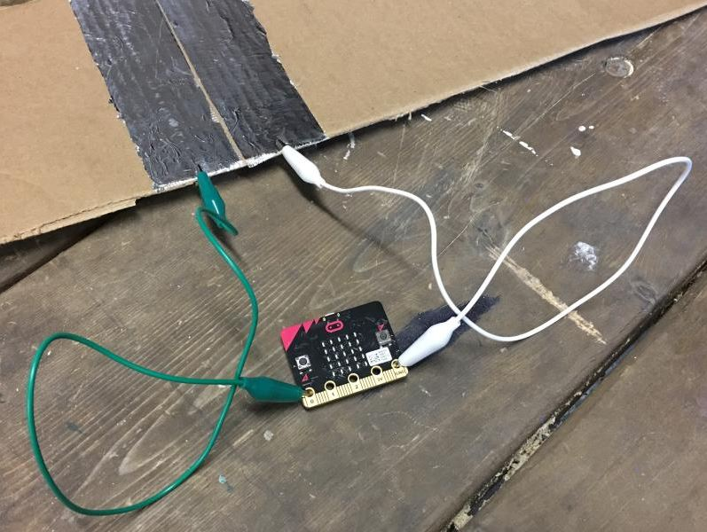

The micro bit timing gate is a similar concept to my project. The timing gate uses metal plates to pickup when something has been sent across them  and send a message to the micro bit telling it to turn the timer off.  The timing gates code is also similar to the code I will use in my project. The similarities are that the ball in my project will roll onto a conductive platform and turn off and on a timer in the micro bit.
https://makecode.microbit.org/projects/timing-gates

### Related project 2 ###
 Maze Runner
 
 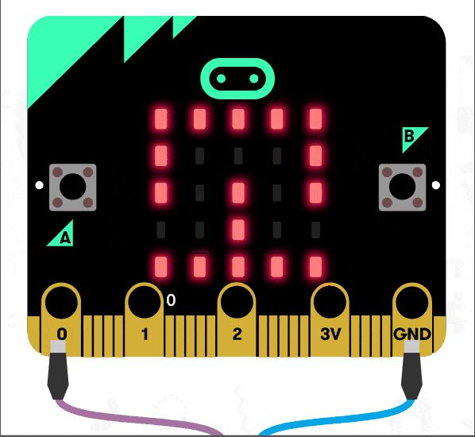
 
This project relates to my project as it is a maze that is coded to know when the maze has been completed, Similar to my project the micro bit changes when the goal has been complete. this project was used as inspiration.  
https://tinkercademy.com/tutorials/maze-runner/

### Related project 3 ###
Microbit football

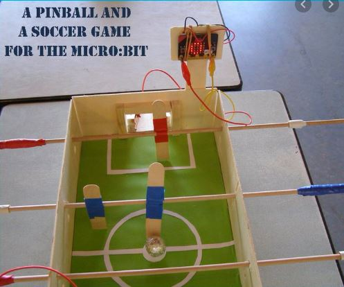

This project relates to my project as it uses a conductive ball to cross a goal that send a messege to the microbit creating a action for example this one keeps the score where mine changes where it wants you to go. 

https://www.youtube.com/watch?v=ZNpZgQ5MXwI&feature=youtu.be
### Related project 4 ###
Reaction time microbit game

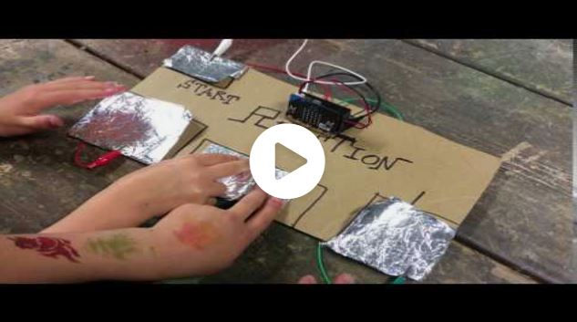

The Materials used in this project are the same as what my project requires. it uses a conductive material that creatres a action with the microbit. the crocidile clamps are connecting everthing together. 

https://makecode.microbit.org/projects/reaction-time

### Related project 5 ###
Microbit arrow

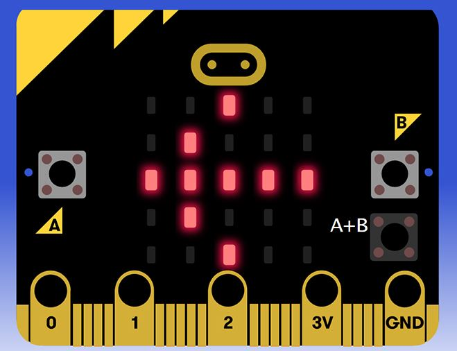

The code used in this basic project will be part of the project uising the arrows to point where the ball needs to head next. The arrow in my project will be guids as to where the next goal is. 
https://www.elecfreaks.com/store/blog/post/micro-bit-fundamental-course-buttondisplay.html

### Related project 6 ###
Count Down Timer

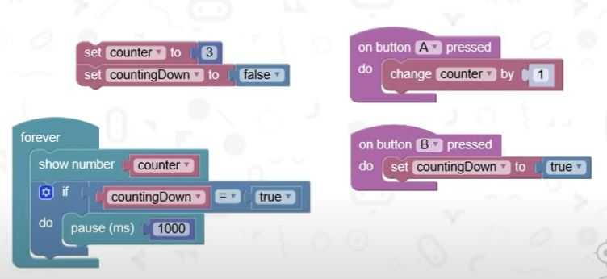

The microbit code seen here will be used to let the player know when they are out of time and how long they have to get there. This code will be mixed with code for the arrows in correlation. 
https://www.youtube.com/watch?v=mnBYkQ9ku8I

## Other research ##
I have taken inspiration from a toutorial made by Pinkey Pepper the youtube chanel where they have made a maze game the points to where you are required to travel. Although simular in design mine is diffrent in that it has a inbuilt time limit and multiple destinations for the ball to travel. The code will also be diffrent as there are many parts needing to  be added.

### *Brief resource name/description* ###

https://www.youtube.com/watch?v=2JCDVCSQpik

## Conceptual progress ##

### Design intent ###
My intent is to create a functioning ball maze race with multiple goals and a timer making the game challlenging and fun. 

### Design concept 1 ###

Random number generated boardgame

The game is designed around the micro bit picking a random number and a player having to move the amount shown by the micro bit.  The micro bit would also show symbols that correlate with a action in the game.  There is a button on the micro bit and depending on how long it is pressed the higher the number will show but this also increases the chances of getting a symbol. 

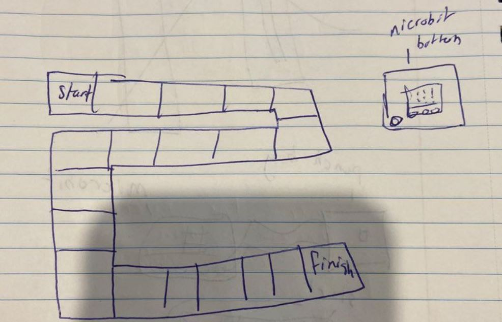

### Design concept 2 ###
Power measurer board game

Similar to concept 1 the goal of this game is reach the end of a track. Depending on how hard the pressure sensor is hit the micro bit will display the distance the player will travel.  It will use a punching bag containing a sensor.

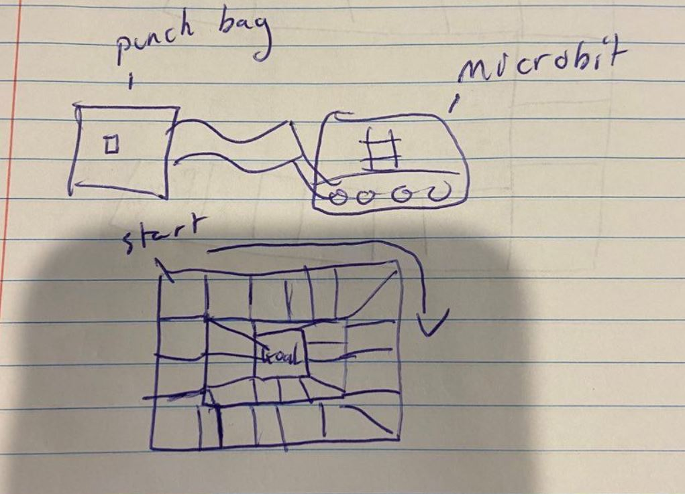

### Final design concept ###
Ball Maze Race

My final concept is a ball maze that is a race against a timer.  The micro bit will display an arrow poiting to where the ball needs to travel at the same time the timer will start.  The aim is to reach the goal before the timer runs out.  The ball and goals will both be covered in copper tape or tin foil so that when the ball touches the copper it will send a signal to the micro bit letting it know it has reached the goal. As soon as the ball reaches the goal the timer will restart and point to another goal.  The maze will have rope on either side used to move the ball around. At the current stage the ball will only have 10 seconds to reach each goal. There is a punishement for not reaching the goal eg take a drink. The maze will be made using cardboard. 

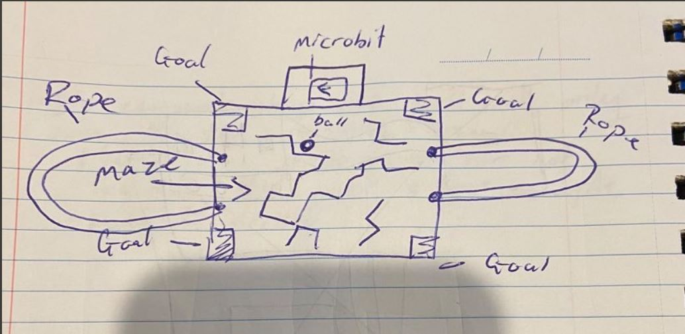

### Interaction flowchart ###

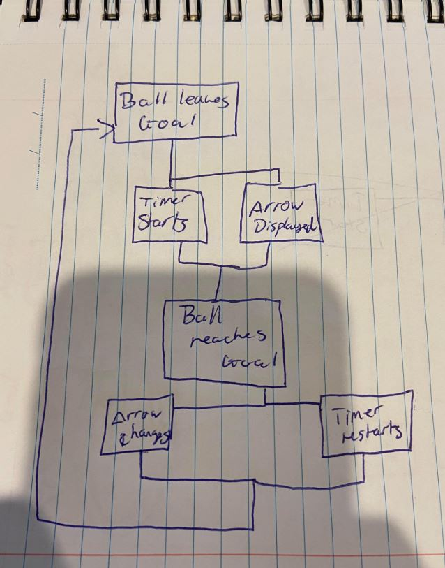

## Physical experimentation documentation ##

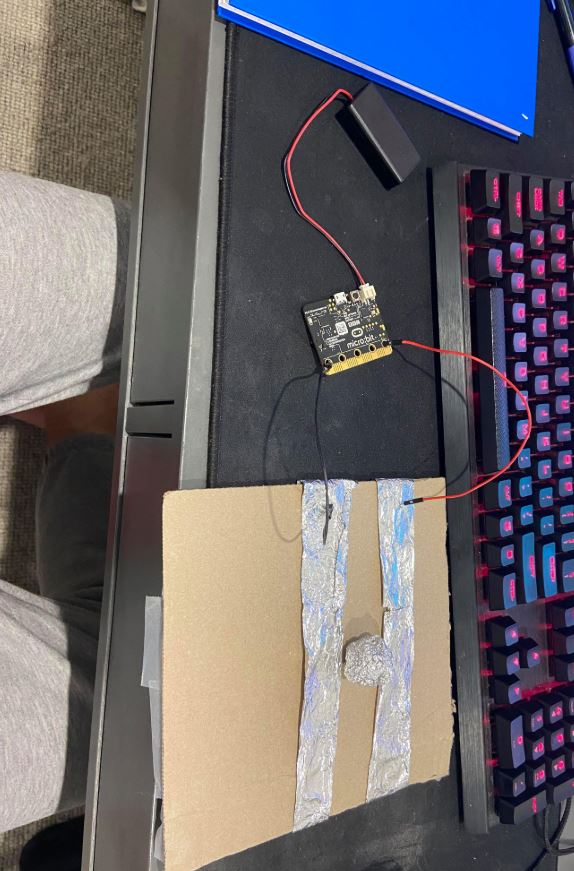

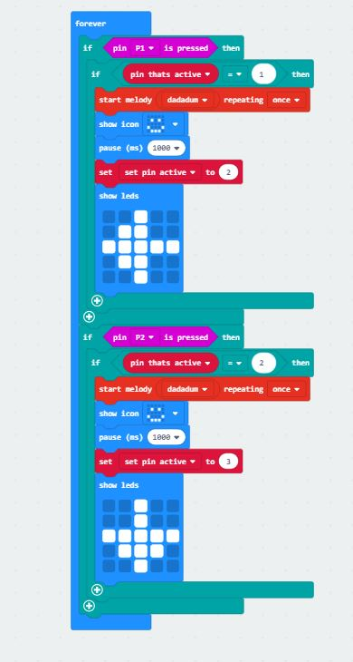

## Design process discussion ##
*Discuss your process in getting to this point, particularly with reference to aspects of the Double Diamond design methodology or other relevant design process.*

Getting to the point i am now I used lots of advice from my tut and discussion boards. I also used The Double Dimond design methodology.
I used time we had in tut sessions to bounce ideas off people in order to create a better idea of what i wanted to make. 

Using the Double Dimond method when talking to people in my tut  during the discover phase I found that my project should be able to entertain multiple people. The people I was talking to agreed with the idea. I then using the define phase decided that the  projects goal is to become a competitive game that can be used at parties and other events. For example it can be used as a drinking game.
I then researched ideas and methods of achieving this method and was inspired my ball mazes and how i could incorporate that into a project that people can be entertained by.  I am now still in the deliver phase and working on the code i will use to achieve the functions i am aiming for with my project.

## Next steps ##
1- Obtain materials.

2- work on incorpirating everthing into the code.

3- Build project.

4- make sure everthing works and correwct errors.

5-film video and submit.
